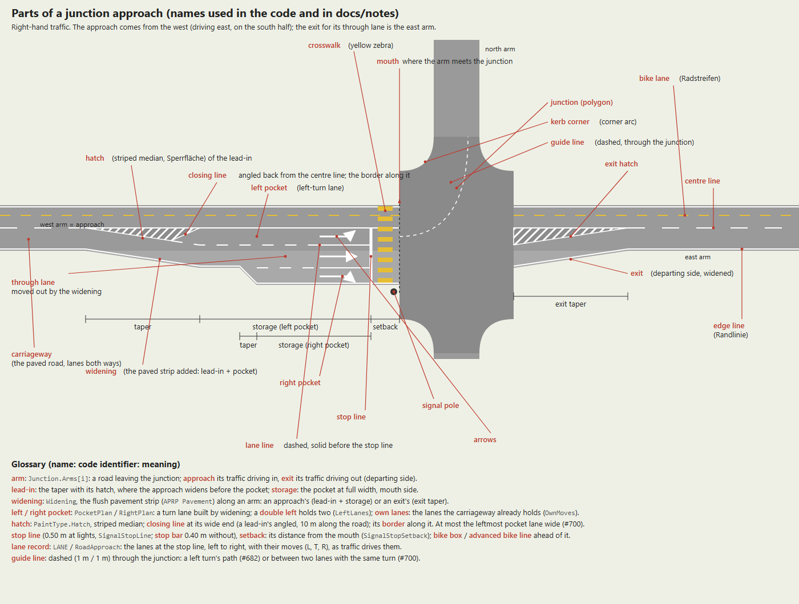

> [!NOTE]
> This file was fully generated by Claude.

# Parts of a junction approach: names (#700)

The names the code and the notes use for each part of an approach and a junction, so a review can say "the
closing line of the lead-in hatch" instead of paraphrasing. Source: `intersection-parts.svg` (edit that, then
re-export the PNG: Edge headless `--screenshot --window-size=1400,1060`).

- **arm** (`Junction.Arms[i]`): a road leaving the junction; its **approach** is the traffic driving in, its
  **exit** the traffic driving out (departing side). The **mouth** is where the arm's ribbon meets the junction
  polygon (the arm's trim); the **kerb corner** (corner arc) rounds the junction between two arms.
- **lead-in**: the **taper** where the approach widens, with its **hatch** (striped median, Sperrfläche) closed by
  the **closing line** (angled on a lead-in, #700) and bordered along its length; then the **storage**, the left
  (or right) **pocket** at full width, up to the **stop line**, which stands the **setback** back from the mouth.
- **widening** (`Widening`): the flush pavement strip a pocket or an exit adds beside the carriageway; an **exit**
  widening has its **exit taper** and **exit hatch**.
- **own lanes**: the lanes the carriageway already holds (`OwnMoves`, #700); a **double left** is a pocket of two
  lanes (`LeftLanes`).
- **lines**: **centre line**, **lane line** (dashed, solid before the stop line), **edge line** (Randlinie),
  **bike lane** (Radstreifen, yellow), **guide line** (dashed through the junction), **crosswalk** (yellow zebra).
- **lane record** (`LANE`, `RoadApproach`): the lanes at the stop line, left to right, with their moves.
